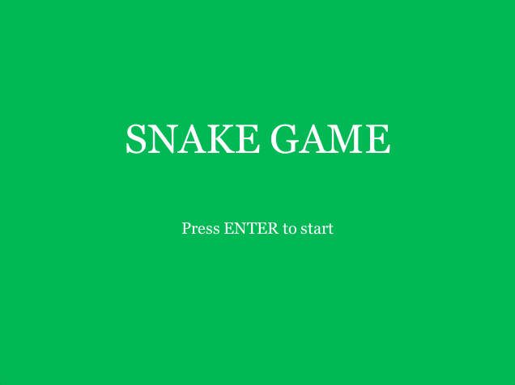
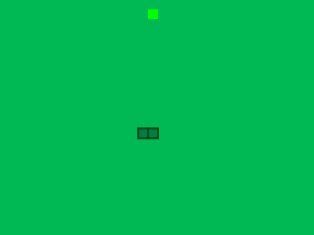
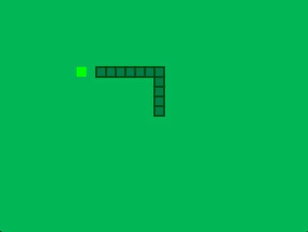
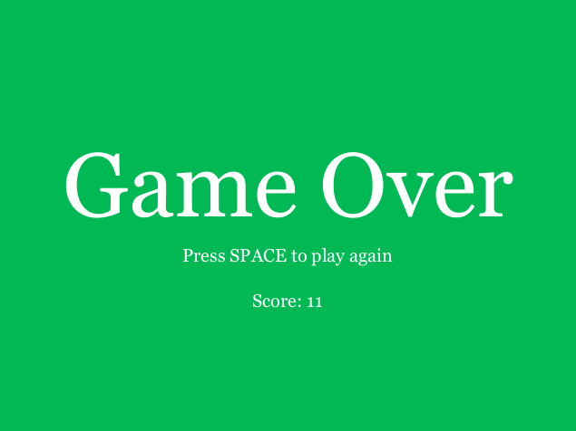

<<<<<<< HEAD
# Snake Game

## Description
This project is a recreation of the classic Snake game, developed using Processing.

Players control a snake that moves around the screen, growing longer each time it eats food.

The objective is to navigate the snake without crashing into the walls or its own body.

The game features basic mechanics, including movement, collision detection, and scoring.

It also includes a start screen and a game over screen with the final score.

This project demonstrates the implementation of classic game logic and design in a simple, yet engaging way.

## Screenshots
Here are some screenshots of the game:

**Start Screen**  

**Starting the Game**  

**Snake Growing**  

**Game Over Screen**  

## Installation
To play the game, ensure that you have Processing installed. Download the project files and run `main.pde` using Processing.

## Requirements
- Processing 3.0 or later

## GamePlay

[Watch the Gameplay Video](./Video_SnakeGame.mp4)
=======
Simple Snake Game on Processing 4
>>>>>>> 2f1fbdc6cf22787a75b5b1fd23d748109a009ca0
